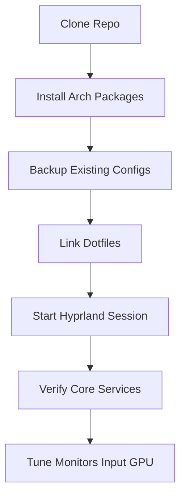

# Arch Linux + Hyprland Dotfiles

Production-ready desktop dotfiles focused on a Hyprland workflow, modular shell setup, and practical developer tooling.

This README documents the committed state of this repository and gives a hardware-agnostic installation path for Arch Linux + Hyprland.

## Highlights

- Hyprland setup split into modular files for keybinds, input, visuals, autostart, monitors, workspaces, and app/window rules.
- Waybar, wlogout, swaync, waypaper, and helper scripts for screenshots, power actions, and wallpaper management.
- Shell stack for `zsh`, `bash`, and `fish` with aliases, prompt customization, and fastfetch autostart.
- Terminal + editor configs for Ghostty, Kitty, and Neovim (LazyVim-based).
- Clear install path that avoids machine-specific state and sensitive data.

## Repository Layout

| Path | Purpose |
| --- | --- |
| `.config/hypr` | Hyprland core config, wallpaper assets, lock/idle config, scripts |
| `.config/waybar` | Waybar modules, style, launch/toggle scripts |
| `.config/wlogout` | Logout menu layout/theme and actions |
| `.config/swaync` | Notification daemon config/theme |
| `.config/zshrc`, `.config/bashrc`, `.config/fish` | Modular shell configs and aliases |
| `.config/nvim` | Neovim (LazyVim) config |
| `.config/kitty`, `.config/ghostty` | Terminal configs |
| `.zshrc`, `.bashrc` | Root shell entrypoints |
| `.gitconfig` | Git defaults (must be personalized before use) |

## Install Flow



## Prerequisites (Arch Linux)

Install base dependencies with `pacman`:

```bash
sudo pacman -S --needed hyprland hyprpaper hypridle hyprlock waybar wlogout swaync walker wofi nautilus grim slurp satty jq brightnessctl playerctl pipewire wireplumber pavucontrol networkmanager blueman rfkill polkit-kde-agent zsh bash fish fzf eza fastfetch btop kitty ghostty neovim fcitx5 fcitx5-gtk fcitx5-qt ttf-fira-sans
```

Optional packages referenced by keybinds or scripts:

```bash
sudo pacman -S --needed firefox-developer-edition
```

Optional AUR packages (if you use `yay`):

```bash
yay -S --needed hyprlauncher oh-my-posh-bin
```

Install at least one Nerd Font used by terminals/bar:

```bash
sudo pacman -S --needed ttf-cascadia-code-nerd
```

## Clone

```bash
git clone https://github.com/Web-Dev-Codi/dotfiles.git "$HOME/dotfiles"
cd "$HOME/dotfiles"
```

## Install (Safe Symlink Method)

### 1) Back up existing configs

```bash
backup_dir="$HOME/.dotfiles-backup-$(date +%Y%m%d-%H%M%S)"
mkdir -p "$backup_dir/.config"
targets=(
  "$HOME/.zshrc"
  "$HOME/.bashrc"
  "$HOME/.config/hypr"
  "$HOME/.config/waybar"
  "$HOME/.config/wlogout"
  "$HOME/.config/swaync"
  "$HOME/.config/zshrc"
  "$HOME/.config/bashrc"
  "$HOME/.config/fish"
  "$HOME/.config/nvim"
  "$HOME/.config/kitty"
  "$HOME/.config/ghostty"
  "$HOME/.config/fastfetch"
  "$HOME/.config/btop"
  "$HOME/.config/fcitx5"
  "$HOME/.config/environment.d"
)
for target in "${targets[@]}"; do
  if [ -e "$target" ] || [ -L "$target" ]; then
    rel="${target#$HOME/}"
    mkdir -p "$backup_dir/$(dirname "$rel")"
    mv "$target" "$backup_dir/$rel"
  fi
done
printf '%s\n' "$backup_dir"
```

### 2) Link reusable dotfiles

```bash
repo="$HOME/dotfiles"
mkdir -p "$HOME/.config"
for dir in hypr waybar wlogout swaync zshrc bashrc fish nvim kitty ghostty fastfetch btop fcitx5 environment.d walker nwg-dock-hyprland nwg-displays waypaper satty qalculate swayosd; do
  ln -sfn "$repo/.config/$dir" "$HOME/.config/$dir"
done
ln -sfn "$repo/.zshrc" "$HOME/.zshrc"
ln -sfn "$repo/.bashrc" "$HOME/.bashrc"
```

### 3) Personalize git identity

Do not keep someone else's identity in your Git config:

```bash
git config --global user.name 'Your Name'
git config --global user.email 'you@example.com'
```

### 4) Start and verify

Log out and start a Hyprland session, then validate:

```bash
hyprctl monitors
hyprctl workspaces
pgrep -a hyprpaper
pgrep -a hypridle
pgrep -a waybar
```

If you changed files while logged in, reload:

```bash
hyprctl reload
```

## Hardware-Agnostic Setup Checklist

These files are expected to be edited per machine:

- `~/.config/hypr/monitors.conf`
- `~/.config/hypr/workspaces.conf`
- `~/.config/hypr/hyprpaper/hyprpaper.conf`
- `~/.config/hypr/hyprpaper/persistent-wallpaper.conf`
- `~/.config/hypr/input/input.conf`
- `~/.config/hypr/environment/env.conf`

Recommended adaptation steps:

1. Configure displays and monitor names for your hardware.
2. Update workspace-to-monitor bindings after monitor changes.
3. Remove or update device-specific input entries (example: custom mouse names).
4. Review GPU-specific environment variables and keep only what matches your hardware.
5. Regenerate persisted wallpaper state if absolute paths reference another username:

```bash
rm -f "$HOME/.config/hypr/hyprpaper/persistent-wallpaper.conf"
```

## Optional Integrations

Some scripts reference external ecosystems:

- `ML4W` paths under `~/.config/ml4w`
- `Omarchy` theme paths under `~/.config/omarchy`

Core Hyprland + Waybar config works without these, but helper scripts/aliases and theme imports may need adjustment if those ecosystems are not installed.

## Security and Sanitization

This repository may contain machine-state or sensitive app files that should not be shared or linked by default in a public setup.

Before publishing a fork, audit and sanitize files like:

- `.config/opencode/opencode.json`
- `.config/pulse/cookie`
- `.config/Typora/*`
- `.config/uv/uv-receipt.json`
- `.config/yay`

General rule:

- Never commit API keys, tokens, cookies, private credentials, or host-specific secrets.
- Keep reusable configs in version control and keep personal state local.

## Troubleshooting

### Waybar does not start

Run directly and inspect output:

```bash
waybar -c "$HOME/.config/waybar/config.jsonc" -s "$HOME/.config/waybar/style.css"
```

### Hyprpaper wallpaper does not apply

```bash
hyprctl hyprpaper unload all
hyprctl hyprpaper preload "$HOME/.config/hypr/assets/astronaut.png"
for monitor in $(hyprctl monitors -j | jq -r '.[] | .name'); do
  hyprctl hyprpaper wallpaper "$monitor,$HOME/.config/hypr/assets/astronaut.png"
done
```

### Fcitx5 not active

```bash
systemctl --user restart fcitx5
printenv INPUT_METHOD
printenv QT_IM_MODULE
printenv XMODIFIERS
printenv SDL_IM_MODULE
```

### Screenshot pipeline fails

Verify required tools:

```bash
command -v grim
command -v slurp
command -v satty
```

## Updating Dotfiles

```bash
cd "$HOME/dotfiles"
git pull --ff-only
hyprctl reload
```

If an update breaks your setup, restore from your backup directory created during install.
